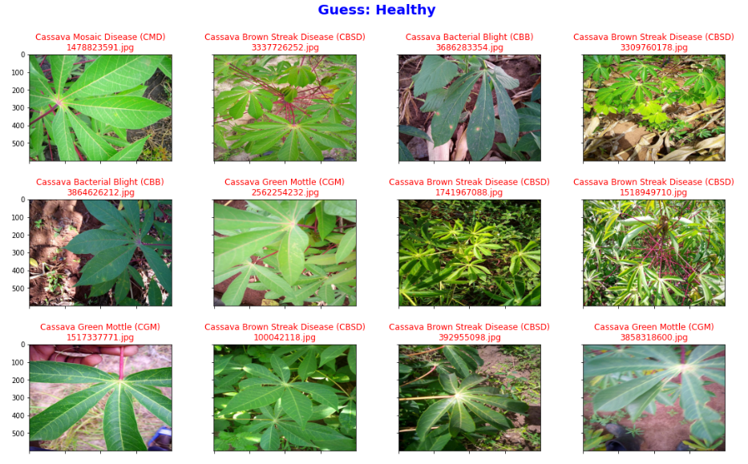
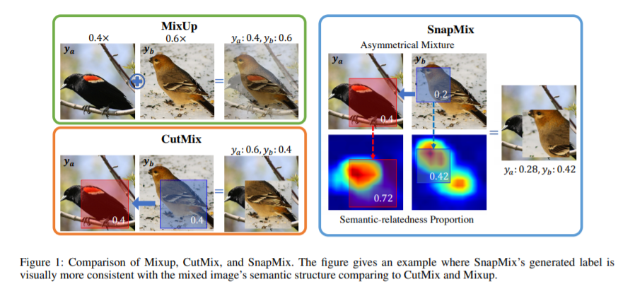
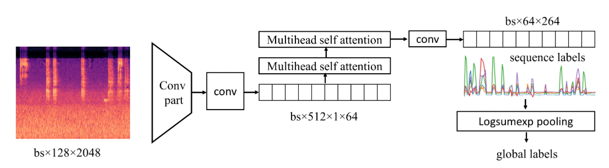

# paper-reading-and-competions

[](https://www.zhihu.com/people/liu-wei-jian-14-51/posts)

# Papers reading note
 [CV](https://github.com/ddmm2020/paper-reading-and-competions/blob/main/papers/CV/computer_vision.md)  
 [HPC about mixed_precision](https://github.com/ddmm2020/paper-reading-and-competions/blob/main/papers/Mixed%20precision/mixed_precision.md)  
 [HPC about NN_pruning](https://github.com/ddmm2020/paper-reading-and-competions/blob/main/papers/NN%20pruning/NN%20Pruning.pdf)  
 
# competions
# Cassava Leaf Disease Classification 铜牌  
Identify the type of disease present on a Cassava Leaf image  
From：Makerere University AI Lab  
### Summary
1. Try different loss functions:  
Basic loss function for classification is cross-entropy loss.But because of the noisy label in this competion, the loss functions with high tolerance to noisy label has better performance.some loss function from ***top solutions***  as below:  
    * Bi-Tempered Logistic Loss (NIPS 2019)  
    * Taylor Cross Entropy loss (IJCAI 2020)  
    * label smoothing is a useful trick.  
2. ViT and EfficientNet are better backbones.  
    Attention Learning in CV.
4. Ensemble
Injecting a lot of diversity in the ensemble is the key to prevent shake in the Private Dataset.
    * light or heaevy TTA is useful
    * stacking 
    * bagging
    * Ensemble different backbones
4. Confident Learning (ICML 2020) [paper](https://arxiv.org/pdf/1911.00068.pdf)  
    Cleanlab package can help us to find some error label.  
    
    
5. Augmentations:  
 Includeing standard enhancements below mix is useful:  
 Mixup(ICLR 2018) [paper](https://arxiv.org/pdf/1710.09412.pdf)/Cutmix(ICCV 2019) [paper](https://openaccess.thecvf.com/content_ICCV_2019/papers/Yun_CutMix_Regularization_Strategy_to_Train_Strong_Classifiers_With_Localizable_Features_ICCV_2019_paper.pdf)  /SnapMix(AAAI 2021) [paper](https://arxiv.org/pdf/2012.04846.pdf)

  
  
7. Others
    * Advprop(CVPR 2020) [paper](https://openaccess.thecvf.com/content_CVPR_2020/papers/Xie_Adversarial_Examples_Improve_Image_Recognition_CVPR_2020_paper.pdf): 
        
        Using auxiliary BN to improve model performance with adversarial examples.
    * LeafGAN(T-ASE 2020) [paper](https://arxiv.org/pdf/2002.10100.pdf): 
        
        attention + CycleGAN to generate Leaf images.
    * CAM [paper](https://arxiv.org/pdf/1512.04150.pdf)：
        
        Help to understand which pixels features are important.

[Some Code and More details](https://github.com/ddmm2020/paper-reading-and-competions/blob/main/competions)


# BirdCLEF 2021 - Birdcall Identification 银牌
Identify bird calls in soundscape recordings  
From:Cornell Lab of Ornithology  
evaluation： F1-Score  
What a shame! We overfitted the public score dataset or we may get a gold medal. :sob: :sob: :sob:  

There are 2 major issues to address in this challenge: (1) label weakness and noise, (2) domain mismatch between train and test data. 


1. Multi-stage training
    using the prediction label to clip the train sound file to get cleaner train clips.

2. Masked loss / Focal loss  
    Primary labels were noisy, but secondary labels were even noisier. As a result we masked the loss for secondary labels as we didn't want to force the model to learn a presence or an absence when we don't know. We therefore defined a secondary mask that nullifies the BCE loss for secondary labels. For instance, assuming only 3 ebird_code b0, b1, and b2, and a clip with primary label b0 and secondary label b1, then these two target values are possible:  
[1, 0, 0]  
[1, 1, 0]  
The secondary mask is therefore:  
[1, 0, 1]  
For merged clips, a target is masked if it it not one of the primary labels and if it is one of the secondary labels.  

3. self-attention block [kaggle discussion](https://www.kaggle.com/c/birdsong-recognition/discussion/183258)  
    CVPR 2015 [paper](https://arxiv.org/pdf/1411.6228.pdf)
   
   

```
class AttnBlock(nn.Module):
    def __init__(self, n=512, nheads=8, dim_feedforward=512):
        super().__init__()
        self.attn = nn.MultiheadAttention(n,nheads)
        self.norm = nn.LayerNorm(n)
        self.drop = nn.Dropout(0.2)
        
    def forward(self, x):
        shape = x.shape
        x = x.view(shape[0],shape[1],-1).permute(2,0,1)
        x = self.norm(self.drop(self.attn(x,x,x)[0]) + x)
        x = x.permute(1,2,0).reshape(shape)
        return x    

class Model(nn.Module):
    def __init__(self, n=len(label_map), arch='resnext50_32x4d_ssl', 
                 path='facebookresearch/semi-supervised-ImageNet1K-models', ps=0.5):
        super().__init__()
        m = torch.hub.load(path, arch)
        nc = list(m.children())[-1].in_features
        self.enc = nn.Sequential(*list(m.children())[:-2])
        
        shape = self.enc[0].weight.shape
        w = self.enc[0].weight.sum(1).unsqueeze(1)
        self.enc[0] = nn.Conv2d(1, 64, kernel_size=(7, 7), stride=(2, 2), padding=(3, 3), bias=False)
        self.enc[0].weight = nn.Parameter(w)

        nh = 768
        self.head = nn.Sequential(nn.Conv2d(nc,nh,(config.n_mels//32,1)),AttnBlock(nh),AttnBlock(nh),
                                  nn.Conv2d(nh,n,1))
        
    def forward(self, x):
        x = self.head(self.enc(x))
        #bs,n,1,len//32
        return torch.logsumexp(x,-1).squeeze() - torch.Tensor([x.shape[-1]]).to(x.device).log()
```
